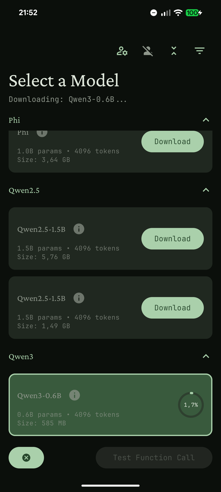
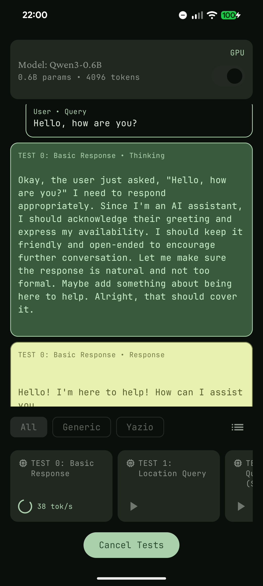
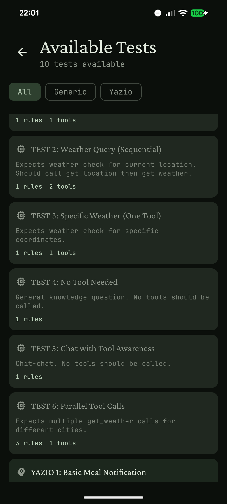

# Edge Agent Lab

A repository for exploring **on-device agentic AI** on Android — running offline using small language models (SLMs), tool calling, and agentic frameworks.

This repo contains two apps built on a shared multi-module core:

- **EdgeLab** — a test and validation platform for on-device LLM tool calling
- **CyclingCopilot** — an AI cycling assistant demo (in progress)

Built with [LiteRT-LM](https://github.com/google-ai-edge/LiteRT-LM), [JetBrains Koog](https://github.com/JetBrains/koog), and [HuggingFace](https://huggingface.co/).

---

### Learn More

| Resource | Description |
|----------|-------------|
| 🌐 [edgeagentlab.dev](https://edgeagentlab.dev) | Microsite with test visualizations and project overview |
| [Part #1 — From Flat Notifications to Edge AI](https://monday8am.com/blog/2025/10/01/flat-notifications-edge-ai.html) | Initial concept and motivation |
| [Part #2 — Function Calling with Edge AI](https://monday8am.com/blog/2025/12/10/function-calling-edge-ai.html) | Deep dive into on-device tool calling challenges |
| [Part #3 — Let's talk about FunctionGemma](https://monday8am.com/blog/2026/02/08/lets-talk-about-functiongemma.html) | Exploring FunctionGemma and where it fits in mobile development |

---

### Architecture

The project uses a **multi-module KMP-ready architecture** with a shared Android core:

| Module | Type | Description |
|--------|------|-------------|
| `:data` | Pure Kotlin | Data models, provider interfaces |
| `:agent` | Pure Kotlin | Agent logic, tool handlers, inference interfaces |
| `:presentation` | Pure Kotlin | MVI ViewModels, test engine (KMP-ready) |
| `:core` | Android library | Shared infrastructure: inference, download, OAuth, storage |
| `:app:edgelab` | Android app | EdgeLab — model testing and tool calling validation |
| `:app:copilot` | Android app | CyclingCopilot — on-device AI cycling assistant |

Module dependencies: `:data` ← `:agent` ← `:presentation` ← `:core` ← `:app:edgelab`, `:app:copilot`

For full technical details see [`docs/architecture.md`](docs/architecture.md).

---

### Documentation

| Document | Description |
|----------|-------------|
| [`docs/architecture.md`](docs/architecture.md) | Full technical architecture and implementation details |
| [`docs/edgelab/roadmap.md`](docs/edgelab/roadmap.md) | EdgeLab roadmap |
| [`docs/cyclingcopilot/roadmap.md`](docs/cyclingcopilot/roadmap.md) | CyclingCopilot roadmap |
| [`docs/cyclingcopilot/ui-architecture.md`](docs/cyclingcopilot/ui-architecture.md) | CyclingCopilot UI design and screen specs |

---

### Screenshots

  
  
  

---

### Tech Stack

- Kotlin (Multiplatform-ready modules)
- Jetpack Compose
- LiteRT-LM
- JetBrains Koog
- HuggingFace Hub integration
- Firebase Crashlytics

---

_This is a prototype built for **fast iteration**, **experimentation**, and **learning** — exploring the limits of edge AI and agentic workflows on Android._

---

### License

MIT License — see the [LICENSE](LICENSE) file for details.
